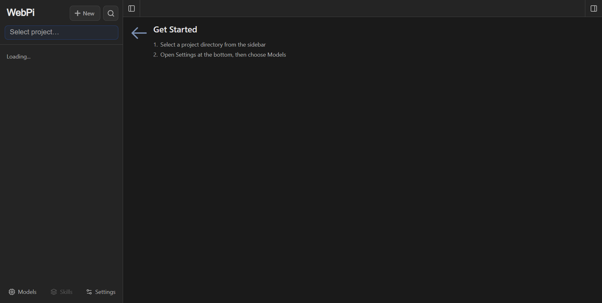

# WebPi Desktop

[English](./README.md) | [日本語](./README.ja.md) | [Русский](./README.ru.md)

**WebPi Desktop 是 [pi coding agent](https://github.com/earendil-works/pi) 的桌面客户端，基于 WebPi 构建。** 它就是一个带托盘图标的普通桌面窗口：启动应用即启动服务、退出应用即停止服务，而且**不需要装 Node.js**。它读取与 pi 相同的配置、凭据与会话文件——终端里开始的对话能在桌面端打开，桌面端聊的也能回到终端继续。



本仓库里有**两个东西**，共用同一份 pi 数据（会话与凭据都在 `~/.pi/agent`）：

| | 是什么 | 怎么跑 |
| --- | --- | --- |
| **WebPi Desktop** | 桌面客户端——独立窗口与托盘图标，服务随应用启停 | 从[发布页](https://github.com/citie114514/pi-web/releases/latest)下载安装包或便携版，或 `npm run desktop` |
| **WebPi** | 它基于的浏览器界面：会话、对话、模型、文件、终端，pi 能做的都在里面 | 全局命令 `webpi`，或在 pi 里执行 `/webpi` |

## 这不是什么

GitHub 上 pi 的前端已经很多，名字也容易撞。先说清楚本项目的边界：

- **不是终端桥接**。WebPi 是真正的 Web 界面（Next.js），直接读写 pi 的会话文件与 RPC，不是把 TUI 用 xterm.js 搬到浏览器。
- **不是另一套 agent 运行时**。会话管理、模型与登录配置、agent 执行全部走上游 `pi`；界面只是它外面的一层壳。
- **基于 `agegr/pi-web`**，Web 界面来自那里。WebPi Desktop 在此之上加了桌面外壳、打包，以及对 Windows 更友好的启动流程。

WebPi 是 [pi-web](https://github.com/agegr/pi-web) 的下游构建：应用本体是上游的工作，本仓库增加了 `webpi` 命令、WebPi Desktop 桌面客户端、Pi 包、对 Windows 更友好的启动流程，以及 WebPi 品牌。差异细节见 [docs/webpi.md](./docs/webpi.md)，桌面端见 [docs/webpi-desktop.md](./docs/webpi-desktop.md)，上游合并机制见 [docs/upstream-sync.md](./docs/upstream-sync.md)，fork 起点见 [docs/upstream-inventory.md](./docs/upstream-inventory.md)。

## 功能

- **会话工作区**：按项目分组浏览、继续、重命名、导出和删除对话，并显示运行状态、上下文占用、费用与压缩信息。
- **两种分支方式**：**新建会话**从某条历史消息派生独立的会话文件；**从此处编辑**在当前会话内创建分支。
- **项目文件工具**：浏览与上传文件、查看 Git 差异，预览源码、Markdown、图片、音频、PDF 与 DOCX，并自动刷新。
- **Git worktree**：在侧边栏切换检出目录，同一仓库的会话仍归为一组。
- **网页端配置**：登录 provider、管理 API Key、模型、模型测试、插件包与技能，无需离开浏览器。
- **中／英／繁三语界面**：初始跟随浏览器语言，顶栏可随时切换。

## 快速开始

### 桌面应用

到[发布页](https://github.com/citie114514/pi-web/releases/latest)下载对应平台的构建并运行即可。启动应用就是启动 WebPi 服务，退出应用就是停止该服务，不需要另外安装任何东西。

| 平台 | 安装包 | 便携版 |
| --- | --- | --- |
| Windows x64 | `WebPi-Setup-<版本>-x64.exe`（按用户安装，不需要管理员权限） | `WebPi-Portable-<版本>-x64.exe`、`WebPi-<版本>-win-x64-portable.zip` |
| Linux x64 | `WebPi-<版本>-linux-x86_64.AppImage`、`WebPi-<版本>-linux-amd64.deb` | `WebPi-<版本>-linux-x64-portable.zip` |
| Linux arm64 | `WebPi-<版本>-linux-arm64.AppImage`、`WebPi-<版本>-linux-arm64.deb` | `WebPi-<版本>-linux-arm64-portable.zip` |
| macOS x64 / arm64 | `WebPi-Setup-<版本>-<arch>.dmg` | `WebPi-<版本>-mac-<arch>-portable.zip` |

应用与服务的关系、便携模式与签名提示见 [桌面应用](#桌面应用)。

### `webpi` 命令

需要 Node.js 22.19.0 或更高版本。先用 `node --version` 确认，然后把本仓库安装为全局命令：

```bash
git clone https://github.com/citie114514/pi-web
cd pi-web
npm install
npm run build
npm install -g .
webpi
```

服务就绪后 `webpi` 会尝试自动打开浏览器；如果没有打开，请访问它打印的地址，默认是 [http://127.0.0.1:30141](http://127.0.0.1:30141)。WebPi 默认只监听 `127.0.0.1`。之后可用 `npm uninstall -g webpi` 卸载。

### 作为 Pi 包

把本目录安装为 Pi 包，即可在 pi 里启动服务：

```bash
pi install /path/to/pi-web
```

然后在 pi 的 TUI 里运行 `/webpi` 启动服务并拿到地址。`/webpi --port 8080` 会把参数转给同一个启动器。这种方式启动的服务会随该 pi 会话结束而停止；需要它在 TUI 退出后继续运行时，请用 shell 或桌面应用启动。

### 配置模型

如果还没有配置模型 provider，打开**模型（Models）**面板登录或添加 API Key。该面板直接使用 pi 的模型、设置与凭据存储，所以无论你在哪个界面修改，另一个界面都能看到；在 pi CLI 里运行 `/login` 写入的是同一份凭据。

如果你只想要上游、不需要这层打包，上游发布的包仍是 `npx @agegr/pi-web@latest`。

## 桌面应用

桌面版就是同一个应用装在独立窗口里，带托盘图标和完整的生命周期：

- **启动应用即启动服务，退出应用即停止服务。** 不是本应用启动的服务不会被停掉：如果该端口上已有另一个 WebPi，应用会另起一个使用空闲端口的实例，保证退出时不会误伤别人。
- **关闭窗口时会询问怎么处理**——最小化到托盘，或直接关闭——并可记住选择，之后可在托盘菜单里随时改回。
- **托盘菜单**还能显示／隐藏窗口、重启服务、退出应用。服务意外退出时会弹窗，可选择重启或退出。
- **便携模式**：便携版把设置保存在解压目录内，整个文件夹可以拷到 U 盘使用；pi 自身的数据仍在 `~/.pi/agent`。

构建未做代码签名，因此 Windows SmartScreen 与 macOS Gatekeeper 首次运行会告警；告警的处理方式、便携模式、签名配置与 CI 发布流程见 [docs/webpi-desktop.md](./docs/webpi-desktop.md)。

从源码构建：

```bash
npm run desktop          # 以源码方式运行
npm run desktop:dist     # 构建本平台的安装包与便携版
```

产物在 `release/` 目录。`.github/workflows/desktop-release.yml` 会在每个平台构建、真实启动产物验证可用，并发布 Release。

## 配置

端口与主机名以命令行参数为准，优先于对应环境变量。`--no-open` 与 `PI_WEB_NO_OPEN=1` 中任意一个都会关闭自动打开浏览器。运行 `webpi --help`（或 `-h`）可打印启动选项并以退出码 0 结束，不会启动服务；未知参数会报错退出。

环境变量沿用上游的 `PI_WEB_*` 名称，已有的说明和封装脚本无需改动。

| 选项或环境变量 | 作用 | 默认值 |
| --- | --- | --- |
| `--help`、`-h` | 打印启动选项并退出 | — |
| `--port <端口>`、`-p <端口>` 或 `PORT` | 服务端口 | `30141` |
| `--hostname <主机>`、`-H <主机>` 或 `PI_WEB_HOSTNAME` | 绑定主机名 | `127.0.0.1` |
| `--no-open` 或 `PI_WEB_NO_OPEN=1` | 不自动打开浏览器 | 自动打开 |
| `PI_WEB_SKIP_VERSION_CHECK=1` | 关闭 WebPi 更新检查 | 未设置 |
| `PI_WEB_ALLOWED_HOSTS` | 额外允许的精确代理或自定义主机名，逗号分隔 | 未设置 |
| `PI_WEB_PASSWORD` | 启用浏览器密码登录；API 客户端可用用户名 `pi` 走 Basic Auth | 不启用认证 |
| `PI_WEB_IDLE_TIMEOUT_MS` | 会话空闲超时（毫秒），上限 `2147483647`；`0` 表示不因空闲关闭；非法或越界值按默认处理 | `600000`（10 分钟） |

例如：

```bash
webpi --help
webpi -p 8080 -H 0.0.0.0 --no-open
```

### 启动行为

- 若目标端口上已有 WebPi 服务，会直接复用它：`webpi` 打印其地址并以退出码 0 结束，不会在同一批会话文件上再起一个服务。
- 端口被其他程序占用时会跳过，最多顺延尝试十个连续端口并打印实际使用的端口；Next.js 自身拒绝的保留端口也会跳过。
- `--port 0` 表示让操作系统分配一个空闲端口。
- 独立运行的 `webpi` 命令会一直运行，直到你用 `Ctrl+C` 停止。

### 远程访问

绑定到非回环地址等于把一个能执行高权限操作的智能体暴露出去。在可信局域网内，请设置足够长的随机密码：

```bash
PI_WEB_PASSWORD='一个很长的随机密码' webpi --hostname 0.0.0.0
```

密码认证不会加密连接。不要把 WebPi 以明文 HTTP 暴露到公网；请通过可信反向代理或 VPN 走 HTTPS。如果反向代理会转发外部主机名，把该精确主机名加入 `PI_WEB_ALLOWED_HOSTS`。这个白名单不会改变 WebPi 实际绑定的地址。

### HTTP 代理

服务端的模型与 API 请求遵循标准的 `HTTP_PROXY`、`HTTPS_PROXY`、`NO_PROXY` 环境变量。

macOS 或 Linux：

```bash
HTTP_PROXY=http://127.0.0.1:7890 \
HTTPS_PROXY=http://127.0.0.1:7890 \
NO_PROXY=localhost,127.0.0.1 \
webpi
```

Windows PowerShell：

```powershell
$env:HTTP_PROXY = "http://127.0.0.1:7890"
$env:HTTPS_PROXY = "http://127.0.0.1:7890"
$env:NO_PROXY = "localhost,127.0.0.1"
webpi
```

## 注意事项

- **智能体数据**：WebPi 默认从 `~/.pi/agent` 读取 pi 数据，会话文件位于 `sessions/<编码后的工作目录>/<时间戳>_<uuid>.jsonl`。设置 `PI_CODING_AGENT_DIR` 可改用其他 pi 智能体目录。
- **文件系统权限**：WebPi 必须能读取智能体数据目录以及会话记录过的工作目录。需要复用已有会话时，请让 WebPi 与 pi 处于同一文件系统环境。
- **共用配置**：模型面板使用 pi 的模型、设置与凭据存储，改动对两个界面同时生效。
- **文件访问边界**：文件浏览器只能在 WebPi 中选择的工作目录，以及它已知的项目或会话根目录内活动，它不是通用的文件系统浏览器。
- **Git worktree**：切换器可见性、worktree 的创建与删除行为见 [WebPi 中的 worktree](./docs/worktrees.zh-CN.md)。
- **基于 WebPi 二次开发**：封装项目可挂接会话行右键菜单与扩展会话存活租约，见 [下游集成接口](./docs/downstream-integration.md)。

## 开发

```bash
npm install
npm run dev
```

开发服务器运行在 [http://127.0.0.1:30141](http://127.0.0.1:30141)。常用检查：

```bash
npm test
node_modules/.bin/tsc --noEmit
npm run lint
```

日常开发中不要运行 `next build` 或 `npm run build`：它会写入 `.next/`，可能干扰开发服务器。构建留给发布环节。

贡献者文档：[上游同步](./docs/upstream-sync.md)（本 fork 每周跟踪上游）、[国际化](./docs/i18n.md)、[发布流程](./docs/release.md)。

## 仓库结构

```text
app/             Next.js 界面与 API 路由
components/      React 界面组件
hooks/           客户端状态与交互逻辑
lib/             会话、智能体、模型、文件、Git 与安全逻辑
public/          静态资源与 PWA 文件
bin/             npm CLI 入口、启动参数解析、启动端口选择
desktop/         Electron 外壳：窗口、托盘、服务生命周期、打包
extensions/      Pi 包扩展，提供 /webpi 命令
skills/          Pi 包技能
docs/            面向使用者与贡献者的专题文档
demo/            发布到 GitHub Pages 的静态演示（见 demo/README.md）
```

架构说明与详细文件地图见 [AGENTS.md](./AGENTS.md)。

## 许可证

[MIT](./LICENSE)。保留上游版权与署名；WebPi 是 [pi-web](https://github.com/agegr/pi-web) 的下游构建。
